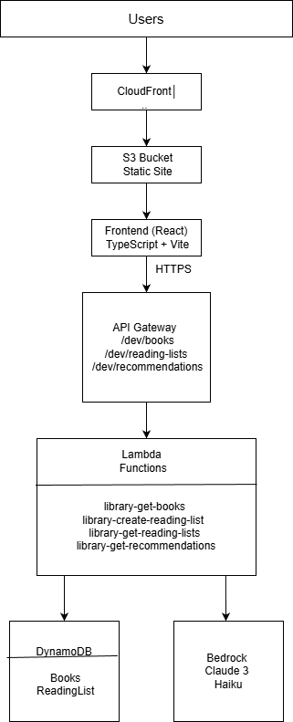
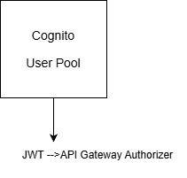

Library Recommendation System
Free tier usage is over so app link won’t be active
Live Demo: https://drqoe89aj59cq.cloudfront.net

AI-powered book recommendation system built with React and AWS serverless architecture.


Features

- User Authentication - AWS Cognito with email verification
- Book Catalog - Browse books with detailed information
- AI Recommendations- Smart book suggestions powered by AWS Bedrock (Claude 3 Haiku)
- Reading Lists- Create personal reading lists
- Modern UI- Responsive design with Tailwind CSS
- Serverless - Fully deployed on AWS (CloudFront, S3, Lambda, DynamoDB)
- CI/CD Pipeline - Automated deployment with AWS CodePipeline

Architecture

Architecture Diagram:
```


 

Authentication:





CI/CD Pipeline: 

GitHub --> CodePipeline --> CodeBuild --> S3 --> CloudFront 
```
-Frontend
- React + TypeScript + Vite
- Tailwind CSS for styling
- React Router for navigation
- AWS Amplify for Cognito integration

Backend (AWS Serverless)
- API Gateway - REST API endpoints
- Lambda Functions - Serverless compute (Node.js)
- DynamoDB- NoSQL database
- Cognito - User authentication
- Bedrock- AI-powered recommendations (Claude 3 Haiku)

Deployment
- S3 - Static website hosting
- CloudFront - CDN distribution
- CodePipeline - CI/CD automation
- CodeBuild - Build automation

API Endpoints 
Base URL: `https://8d0k7vpis2.execute-api.us-east-1.amazonaws.com/dev` 

### Books 
- `GET /books` - List all boks
- `GET /books/{id}` - Get book details 

### Reading Lists
- `GET /reading-lists` - Get user's reading lists 
- `POST /reading-lists` - Create new reading list 
- `DELETE /reading-lists/{id}` - Delete reading list 


### Recommendations 

- `POST /recommendations` - Get AI-powered book recommendations 

Authentication: All endpoints require JWT token from Cognito

Getting Started

-Prerequisites
- Node.js 20+
- AWS Account
- npm or yarn

### Local Development
```bash
# Install dependencies
npm install

# Run development server
npm run dev

# Build for production
npm run build
```

### Environment Variables

Create `.env` file:
```env
VITE_API_BASE_URL=your-api-gateway-url
VITE_COGNITO_USER_POOL_ID=your-user-pool-id
VITE_COGNITO_CLIENT_ID=your-client-id
VITE_COGNITO_REGION=us-east-1
```
##Testing
```bash
# Run tests
npm test

# Run linting
npm run lint

Tech Stack

Frontend:
- React 18
- TypeScript
- Vite
- Tailwind CSS
- React Router
- AWS Amplify

Backend:
- AWS Lambda (Node.js)
- AWS DynamoDB
- AWS API Gateway
- AWS Cognito
- AWS Bedrock

DevOps:
- AWS CodePipeline
- AWS CodeBuild
- AWS S3
- AWS CloudFront
- GitHub

Author:

Zeynep Mutlu

License:

This project is licensed under the MIT License

 
